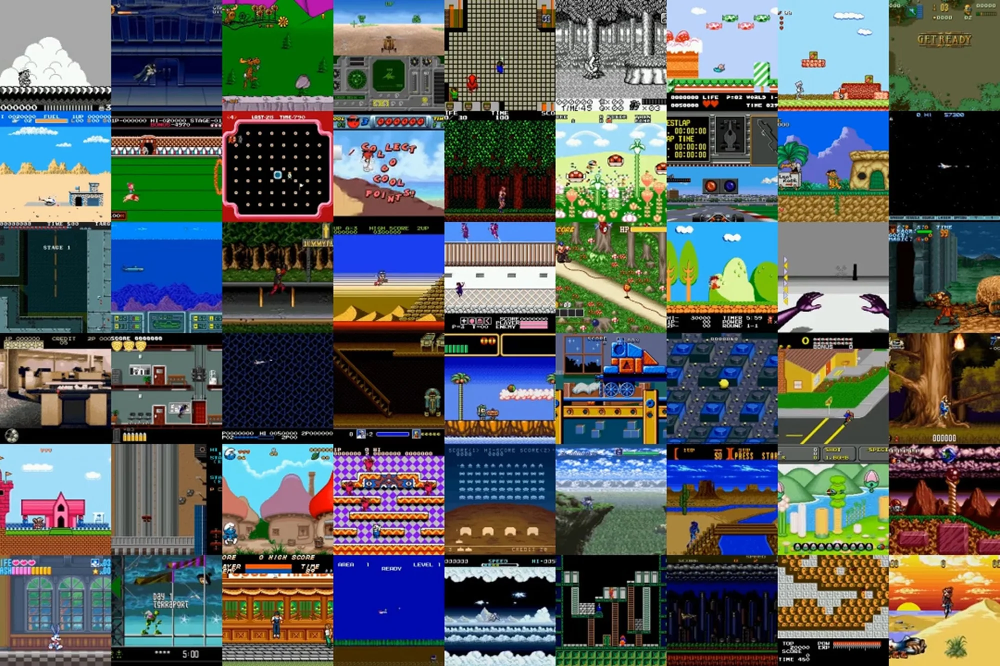

## Gallery

In order to facilitate users' familiarity with the framework, we provide more examples and demos of using OpenRL in Gallery. 

Users are also welcome to contribute their own training examples and demos to the Gallery.

### Tags:

 (Discrete Action Space)

 (Continuous Action Space)

 (Discrete+Continuous Action Space)

 (Imitation Learning or Supervised Learning）

## Algorithm List

|                     Algorithm                     |                                                          Tags                                                           |              Refs               |
|:-------------------------------------------------:|:-----------------------------------------------------------------------------------------------------------------------:|:-------------------------------:|
|      [PPO](https://arxiv.org/abs/1707.06347)      |                                                          |  [code](./examples/cartpole/)   |
|     [PPO-continuous](https://arxiv.org/abs/1707.06347)      |                                                          |  [code](./examples/mujoco/)    |
| [Dual-clip PPO](https://arxiv.org/abs/1912.09729) |                                                          |  [code](./examples/cartpole/)   |
|     [MAPPO](https://arxiv.org/abs/2103.01955)     |                                                          |  [code](./examples/mpe/)   |
|     [JRPO](https://arxiv.org/abs/2302.07515)      |                                                          |  [code](./examples/mpe/)   |
|      [MAT](https://arxiv.org/abs/2205.14953)      |                                                          |  [code](./examples/mpe/)   |

## Demo List

|                                                                                                   Environment/Demo                                                                                                    |                                                          Tags                                                           |              Refs               |
|:---------------------------------------------------------------------------------------------------------------------------------------------------------------------------------------------------------------------:|:-----------------------------------------------------------------------------------------------------------------------:|:-------------------------------:|
|                                                  [MuJoCo](https://github.com/deepmind/mujoco)                                                      |                                                          |   [code](./examples/mujoco/)    |
|                               [CartPole](https://gymnasium.farama.org/environments/classic_control/cart_pole/)                                   |                                                          |  [code](./examples/cartpole/)   |
|                       [MPE: Simple Spread](https://pettingzoo.farama.org/environments/mpe/simple_spread/)                           |    |     [code](./examples/mpe/)     |
| [Super Mario Bros](https://github.com/Kautenja/gym-super-mario-bros)    |   | [code](./examples/super_mario/) |
|                                                [Gym Retro](https://github.com/openai/retro)                                                    |   |    [code](./examples/retro/)    |

