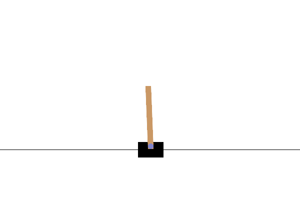
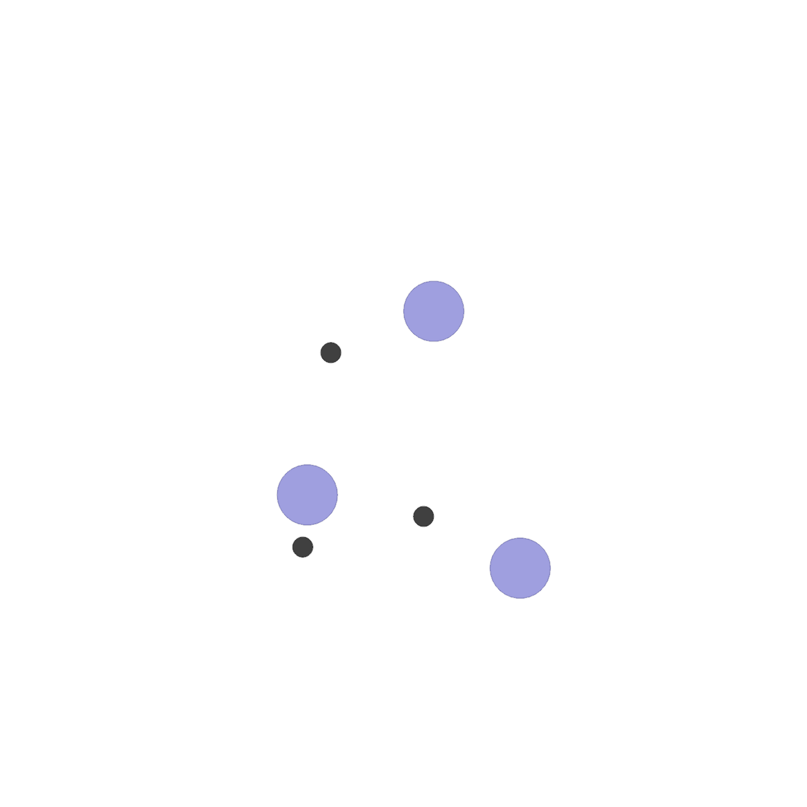

## Gallery

### Tags:

 (Discrete Action Space)

 (Continuous Action Space)

 (Discrete+Continuous Action Space)

 (Imitation Learning or Supervised Learning）

## Demo List

|                                                                             Environment/Demo                                                                             |                                                          Tags                                                           |             Refs             |
|:------------------------------------------------------------------------------------------------------------------------------------------------------------------------:|:-----------------------------------------------------------------------------------------------------------------------:|:----------------------------:|
|     [CartPole](https://gymnasium.farama.org/environments/classic_control/cart_pole/)        |                                                          | [code](./examples/cartpole/) |
| [MPE: Simple Spread](https://pettingzoo.farama.org/environments/mpe/simple_spread/)    |    |   [code](./examples/mpe/)    |

