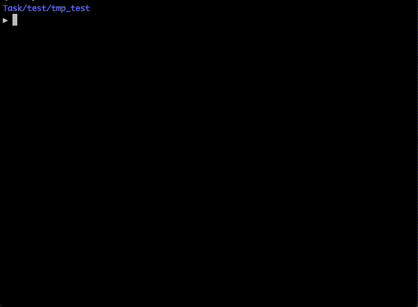

## Gallery

In order to facilitate users' familiarity with the framework, we provide more examples and demos of using OpenRL in Gallery. 

Users are also welcome to contribute their own training examples and demos to the Gallery.

### Tags:

 (Value-based RL)

 (Off-policy RL)

 (Discrete Action Space)

 (Continuous Action Space)

 (Discrete+Continuous Action Space)

 (Imitation Learning or Supervised Learning）

## Algorithm List

|                               Algorithm                                |                                                                                        Tags                                                                                         |               Refs                |
|:----------------------------------------------------------------------:|:-----------------------------------------------------------------------------------------------------------------------------------------------------------------------------------:|:---------------------------------:|
|                [PPO](https://arxiv.org/abs/1707.06347)                 |                                                                                                                      |   [code](./examples/cartpole/)    |
|           [PPO-continuous](https://arxiv.org/abs/1707.06347)           |                                                                                                                         |    [code](./examples/mujoco/)     |
|           [Dual-clip PPO](https://arxiv.org/abs/1912.09729)            |                                                                                                                      |   [code](./examples/cartpole/)    |
|               [MAPPO](https://arxiv.org/abs/2103.01955)                |                                                                                                                                   |      [code](./examples/mpe/)      |
|                [JRPO](https://arxiv.org/abs/2302.07515)                |                                                                                                                                   |      [code](./examples/mpe/)      |
|                [GAIL](https://arxiv.org/abs/1606.03476)                |                                                                                                                         |     [code](./examples/gail/)      |
| [Behavior Cloning](http://www.cse.unsw.edu.au/~claude/papers/MI15.pdf) |                                                                                                                         | [code](./examples/behavior_cloning/) |
|                 [DQN](https://arxiv.org/abs/1312.5602)                 |        |   [code](./examples/gridworld/)   |
|                [MAT](https://arxiv.org/abs/2205.14953)                 |                                                                     |      [code](./examples/mpe/)      |
|                [VDN](https://arxiv.org/abs/1706.05296)                 |                                                                   |      [code](./examples/mpe/)      |
|                [DDPG](https://arxiv.org/abs/1509.02971)                |                                                                   |     [code](./examples/ddpg/)      |
|                               Self-Play                                |                                                              |   [code](./examples/selfplay/)    |

## Demo List

|                                                                                                   Environment/Demo                                                                                                    |                                                        Tags                                                         |              Refs               |
|:---------------------------------------------------------------------------------------------------------------------------------------------------------------------------------------------------------------------:|:-------------------------------------------------------------------------------------------------------------------:|:-------------------------------:|
|                                                  [MuJoCo](https://github.com/deepmind/mujoco)                                                      |                                                         |   [code](./examples/mujoco/)    |
|                               [CartPole](https://gymnasium.farama.org/environments/classic_control/cart_pole/)                                   |                                                      |  [code](./examples/cartpole/)   |
|                       [MPE: Simple Spread](https://pettingzoo.farama.org/environments/mpe/simple_spread/)                           |    |     [code](./examples/mpe/)     |
|                                                  [StarCraft II](https://github.com/oxwhirl/smac)                                                     |    |    [code](./examples/smac/)     |
|                                [Chat Bot](https://openrl-docs.readthedocs.io/en/latest/quick_start/train_nlp.html)                                   |                                                                      |     [code](./examples/nlp/)     |
|                                        [Atari Pong](https://gymnasium.farama.org/environments/atari/pong/)                                           |                                                                      |    [code](./examples/atari/)    |
|                                   [PettingZoo: Tic-Tac-Toe](https://pettingzoo.farama.org/environments/classic/tictactoe/)                                       |                                                         |  [code](./examples/selfplay/)   |
|                                   [Omniverse Isaac Gym](https://github.com/NVIDIA-Omniverse/OmniIsaacGymEnvs)                                       |                                                      |    [code](./examples/isaac/)    |
|                                                      [GridWorld](./examples/gridworld/)                                                         |                                                         |  [code](./examples/gridworld/)  |
| [Super Mario Bros](https://github.com/Kautenja/gym-super-mario-bros)    |                                                      | [code](./examples/super_mario/) |
|                                                 [Gym Retro](https://github.com/openai/retro)                                                    |                                                      |    [code](./examples/retro/)    |

