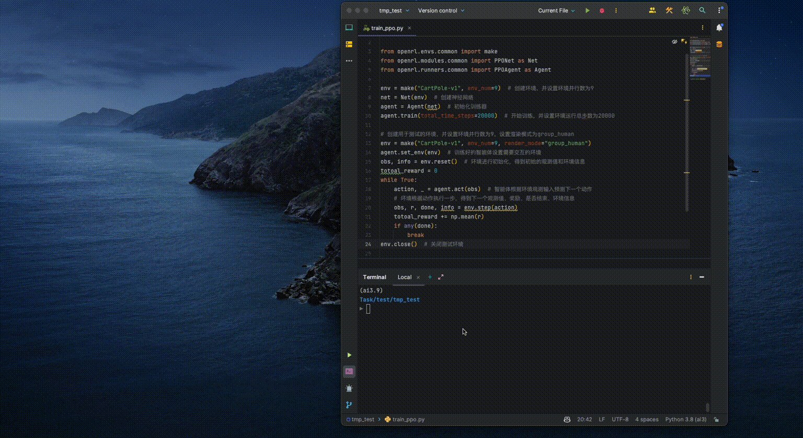

<div align="center">
    <a href="https://openrl-docs.readthedocs.io/zh/latest/index.html"></a>
</div>

---
[](https://pypi.org/project/openrl/)

[](https://anaconda.org/openrl/openrl)
[](https://anaconda.org/openrl/openrl)
[](https://anaconda.org/openrl/openrl)
[](https://github.com/psf/black)


[](https://hitsofcode.com/github/OpenRL-Lab/openrl/view?branch=main)
[](https://codecov.io/gh/OpenRL-Lab/openrl)

[](https://openrl-docs.readthedocs.io/zh/latest/?badge=latest)
[](https://openrl-docs.readthedocs.io/zh/latest/)


[](https://github.com/opendilab/OpenRL/stargazers)
[](https://github.com/OpenRL-Lab/openrl/network)

[](https://github.com/OpenRL-Lab/openrl/issues)
[](https://github.com/OpenRL-Lab/openrl/pulls)
[](https://github.com/OpenRL-Lab/openrl/graphs/contributors)
[](https://github.com/OpenRL-Lab/openrl/blob/master/LICENSE)

OpenRL-v0.0.9 is updated on May 6, 2023 

The main branch is the latest version of OpenRL, which is under active development. If you just want to have a try with OpenRL, you can switch to the stable branch.

## 欢迎来到OpenRL

[English](./README_en.md) | [中文文档](https://openrl-docs.readthedocs.io/zh/latest/) | [Documentation](https://openrl-docs.readthedocs.io/en/latest/)

OpenRL是一个开源的通用强化学习研究框架，支持单智能体、多智能体、自然语言等多种任务的训练。 OpenRL基于PyTorch进行开发，目标是为强化学习研究社区提供一个简单易用、灵活高效、可持续扩展的平台。
目前，OpenRL支持的特性包括：

- 简单易用且支持单智能体、多智能体训练的通用接口
- 支持自然语言任务（如对话任务）的强化学习训练
- 支持从[Hugging Face](https://huggingface.co/)上导入模型和数据
- 支持LSTM，GRU，Transformer等模型
- 支持多种训练加速，例如：自动混合精度训练，半精度策略网络收集数据等
- 支持用户自定义训练模型、奖励模型、训练数据以及环境
- 支持[gymnasium](https://gymnasium.farama.org/)环境
- 支持字典观测空间
- 支持[wandb](https://wandb.ai/)，[tensorboardX](https://tensorboardx.readthedocs.io/en/latest/index.html)等主流训练可视化工具
- 支持环境的串行和并行训练，同时保证两种模式下的训练效果一致
- 中英文文档
- 提供单元测试和代码覆盖测试
- 符合Black Code Style和类型检查

该框架经过了[OpenRL-Lab](https://github.com/OpenRL-Lab)的多次迭代并应用于学术研究，目前已经成为了一个成熟的强化学习框架。
OpenRL-Lab将持续维护和更新OpenRL，欢迎大家加入我们的[开源社区](./CONTRIBUTING.md)，一起为强化学习的发展做出贡献。
关于OpenRL的更多信息，请参考[文档](https://openrl-docs.readthedocs.io/zh/latest/)。

## 目录

- [欢迎来到OpenRL](#欢迎来到openrl)
- [目录](#目录)
- [安装](#安装)
- [使用Docker](#使用docker)
- [快速上手](#快速上手)
- [Gallery](#Gallery)
- [使用OpenRL的项目](#使用OpenRL的项目)
- [反馈和贡献](#反馈和贡献)
- [维护人员](#维护人员)
- [支持者](#支持者)
  - [&#8627; Contributors](#-contributors)  
  - [&#8627; Stargazers](#-stargazers)
  - [&#8627; Forkers](#-forkers)
- [Citing OpenRL](#citing-openrl)
- [License](#license)
- [Acknowledgments](#acknowledgments)

## 安装

用户可以直接通过pip安装OpenRL:
```bash
pip install openrl
```

如果用户使用了Anaconda或者Miniconda，也可以通过conda安装OpenRL:
```bash
conda install -c openrl openrl
```

想要修改源码的用户也可以从源码安装OpenRL:
```bash
git clone https://github.com/OpenRL-Lab/openrl.git && cd openrl
pip install -e .
```

安装完成后，用户可以直接通过命令行查看OpenRL的版本：
```bash
openrl --version
```

**Tips**：无需安装，通过Colab在线试用OpenRL: [](https://colab.research.google.com/drive/15VBA-B7AJF8dBazzRcWAxJxZI7Pl9m-g?usp=sharing)

## 使用Docker

OpenRL目前也提供了包含显卡支持和非显卡支持的Docker镜像。
如果用户的电脑上没有英伟达显卡，则可以通过以下命令获取不包含显卡插件的镜像：

```bash
sudo docker pull openrllab/openrl-cpu
```

如果用户想要通过显卡加速训练，则可以通过以下命令获取：
```bash
sudo docker pull openrllab/openrl
```

镜像拉取成功后，用户可以通过以下命令运行OpenRL的Docker镜像：
```bash
# 不带显卡加速
sudo docker run -it openrllab/openrl-cpu
# 带显卡加速
sudo docker run -it --gpus all --net host openrllab/openrl
```

进入Docker镜像后，用户可以通过以下命令查看OpenRL的版本然后运行测例：
```bash
# 查看Docker镜像中OpenRL的版本
openrl --version
# 运行测例
openrl --mode train --env CartPole-v1
```


## 快速上手

OpenRL为强化学习入门用户提供了简单易用的接口，
下面是一个使用PPO算法训练`CartPole`环境的例子：
```python
# train_ppo.py
from openrl.envs.common import make
from openrl.modules.common import PPONet as Net
from openrl.runners.common import PPOAgent as Agent
env = make("CartPole-v1", env_num=9) # 创建环境，并设置环境并行数为9
net = Net(env) # 创建神经网络
agent = Agent(net) # 初始化智能体
agent.train(total_time_steps=20000) # 开始训练，并设置环境运行总步数为20000
```
使用OpenRL训练智能体只需要简单的四步：**创建环境**=>**初始化模型**=>**初始化智能体**=>**开始训练**！

对于训练好的智能体，用户也可以方便地进行智能体的测试:
```python
# train_ppo.py
from openrl.envs.common import make
from openrl.modules.common import PPONet as Net
from openrl.runners.common import PPOAgent as Agent
agent = Agent(Net(make("CartPole-v1", env_num=9))) # 初始化训练器
agent.train(total_time_steps=20000)
# 创建用于测试的环境，并设置环境并行数为9，设置渲染模式为group_human
env = make("CartPole-v1", env_num=9, render_mode="group_human")
agent.set_env(env) # 训练好的智能体设置需要交互的环境
obs, info = env.reset() # 环境进行初始化，得到初始的观测值和环境信息
while True:
    action, _ = agent.act(obs) # 智能体根据环境观测输入预测下一个动作
    # 环境根据动作执行一步，得到下一个观测值、奖励、是否结束、环境信息
    obs, r, done, info = env.step(action)
    if any(done): break
env.close() # 关闭测试环境
```
在普通笔记本电脑上执行以上代码，只需要几秒钟，便可以完成该智能体的训练和可视化测试：

<div align="center">
  </a>
</div>


**Tips:** 用户还可以在终端中通过执行一行命令快速训练`CartPole`环境:
```bash
openrl --mode train --env CartPole-v1
```

对于多智能体、自然语言等任务的训练，OpenRL也提供了同样简单易用的接口。

关于如何进行多智能体训练、训练超参数设置、训练配置文件加载、wandb使用、保存gif动画等信息，请参考：
- [多智能体训练例子](https://openrl-docs.readthedocs.io/zh/latest/quick_start/multi_agent_RL.html)

关于自然语言任务训练、Hugging Face上模型(数据)加载、自定义训练模型(奖励模型)等信息，请参考：
- [对话任务训练例子](https://openrl-docs.readthedocs.io/zh/latest/quick_start/train_nlp.html)

关于OpenRL的更多信息，请参考[文档](https://openrl-docs.readthedocs.io/zh/latest/)。

## Gallery

为了方便用户熟悉该框架，
我们在[Gallery](./Gallery.md)中提供了更多使用OpenRL的示例和demo。
也欢迎用户将自己的训练示例和demo贡献到Gallery中。

## 使用OpenRL的研究项目

我们在 [OpenRL Project](./Project.md) 中列举了使用OpenRL的研究项目。 
如果你在研究项目中使用了OpenRL，也欢迎加入该列表。

## 反馈和贡献
- 有问题和发现bugs可以到 [Issues](https://github.com/OpenRL-Lab/openrl/issues) 处进行查询或提问
- 加入QQ群：[OpenRL官方交流群](./docs/images/qq.png)

<div align="center">
    <a href="./docs/images/qq.png"></a>
</div>

- 加入 [slack](https://join.slack.com/t/openrlhq/shared_invite/zt-1tqwpvthd-Eeh0IxQ~DIaGqYXoW2IUQg) 群组，与我们一起讨论OpenRL的使用和开发。
- 加入 [Discord](https://discord.gg/tyy96TGbep) 群组，与我们一起讨论OpenRL的使用和开发。
- 发送邮件到: [huangshiyu@4paradigm.com](huangshiyu@4paradigm.com)
- 加入 [GitHub Discussion](https://github.com/orgs/OpenRL-Lab/discussions)

OpenRL框架目前还在持续开发和文档建设，欢迎加入我们让该项目变得更好：

- 如何贡献代码：阅读 [贡献者手册](./CONTRIBUTING.md)
- [OpenRL开发计划](https://github.com/OpenRL-Lab/openrl/issues/2)

## 维护人员

目前，OpenRL由以下维护人员维护：
- [Shiyu Huang](https://huangshiyu13.github.io/)([@huangshiyu13](https://github.com/huangshiyu13))
- Wenze Chen([@Chen001117](https://github.com/Chen001117))

欢迎更多的贡献者加入我们的维护团队 (发送邮件到[huangshiyu@4paradigm.com](huangshiyu@4paradigm.com)申请加入OpenRL团队)。

## 支持者

### &#8627; Contributors

<a href="https://github.com/OpenRL-Lab/openrl/graphs/contributors">
  
</a>

### &#8627; Stargazers

[](https://github.com/OpenRL-Lab/openrl/stargazers)

### &#8627; Forkers

[](https://github.com/OpenRL-Lab/openrl/network/members)

## Citing OpenRL

如果我们的工作对你有帮助，欢迎引用我们:
```latex
@misc{openrl2023,
    title={OpenRL},
    author={OpenRL Contributors},
    publisher = {GitHub},
    howpublished = {\url{https://github.com/OpenRL-Lab/openrl}},
    year={2023},
}
```

## Star History

[](https://star-history.com/#OpenRL-Lab/openrl&Date)

## License
OpenRL under the Apache 2.0 license.

## Acknowledgments
The development of the OpenRL framework has drawn on the strengths of other reinforcement learning frameworks:

- Stable-baselines3: https://github.com/DLR-RM/stable-baselines3
- pytorch-a2c-ppo-acktr-gail: https://github.com/ikostrikov/pytorch-a2c-ppo-acktr-gail
- MAPPO: https://github.com/marlbenchmark/on-policy
- Gymnasium: https://github.com/Farama-Foundation/Gymnasium
- DI-engine: https://github.com/opendilab/DI-engine/
- Tianshou: https://github.com/thu-ml/tianshou
- RL4LMs: https://github.com/allenai/RL4LMs
